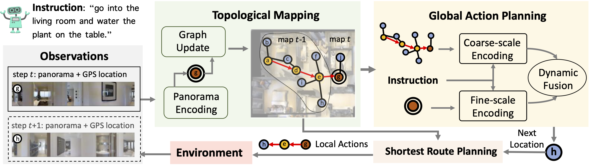

# Think Global, Act Local: Dual-scale GraphTransformer for Vision-and-Language Navigation

This repository is the official implementation of [Think Global, Act Local: Dual-scale GraphTransformer for Vision-and-Language Navigation](https://arxiv.org/abs/2202.11742). 

Winner of the [ICCV 2021 Workshop Human Interaction for Robotic Navigation REVERIE & SOON Challenges](https://human-interaction4robotic-navigation.github.io/challenge.html).

Project webpage: [https://cshizhe.github.io/projects/vln_duet.html](https://cshizhe.github.io/projects/vln_duet.html).

Following language instructions to navigate in unseen environments is a challenging problem for autonomous embodied agents. The agent not only needs to ground languages in visual scenes, but also should explore the environment to reach its target. In this work, we propose a dual-scale graph transformer (DUET) for joint long-term action planning and fine-grained cross-modal understanding. We build a topological map on-the-fly to enable efficient exploration in global action space. To balance the complexity of large action space reasoning and fine-grained language grounding, we dynamically combine a fine-scale encoding over local observations and a coarse-scale encoding on a global map via graph transformers. The proposed approach, DUET, significantly outperforms state-of-the-art methods on goal-oriented vision-and-language navigation (VLN) benchmarks REVERIE and SOON. It also improves the success rate on the fine-grained VLN benchmark R2R.




## Requirements

1. Install Matterport3D simulators: follow instructions [here](https://github.com/peteanderson80/Matterport3DSimulator). We use the latest version instead of v0.1.
```
export PYTHONPATH=Matterport3DSimulator/build:$PYTHONPATH
```

2. Install requirements:
```setup
conda create --name vlnduet python=3.8.5
conda activate vlnduet
pip install -r requirements.txt
```

3. Download data from [Dropbox](https://www.dropbox.com/s/7bijvxdw3rf451c/datasets.tar.gz?dl=0), including processed annotations, features and pretrained models of REVERIE, SOON, R2R and R4R datasets. Put the data in `datasets' directory.

4. Download pretrained lxmert
```
mkdir -p datasets/pretrained 
wget https://nlp.cs.unc.edu/data/model_LXRT.pth -P datasets/pretrained
```

## Pretraining

Combine behavior cloning and auxiliary proxy tasks in pretraining:
```pretrain
cd pretrain_src
bash run_reverie.sh # (run_soon.sh, run_r2r.sh, run_r4r.sh)
```

## Fine-tuning & Evaluation

Use pseudo interative demonstrator to fine-tune the model:
```finetune
cd map_nav_src
bash scripts/run_reverie.sh # (run_soon.sh, run_r2r.sh)
```
